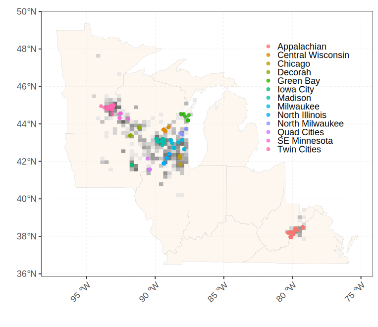
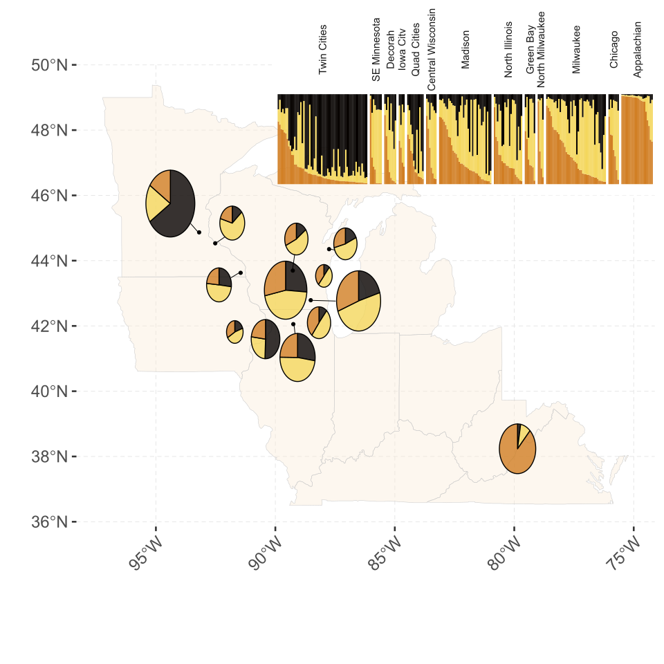
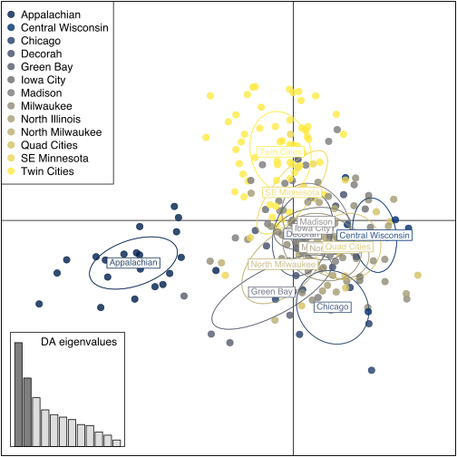
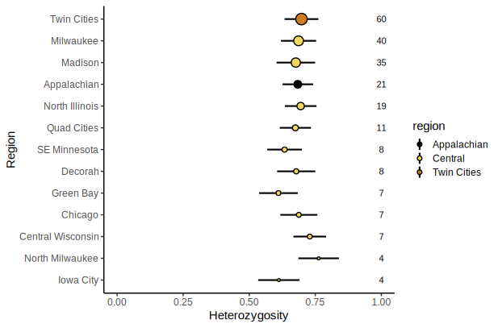
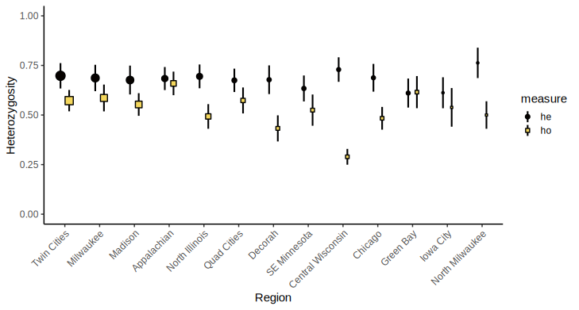
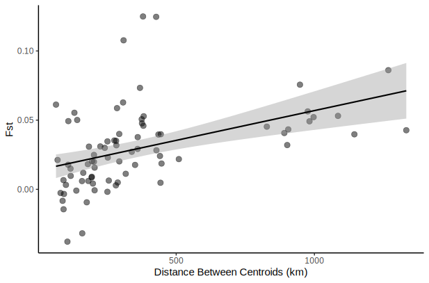
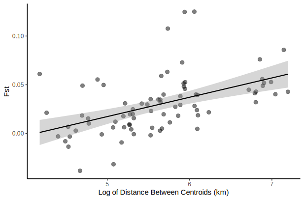
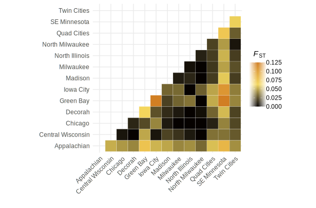
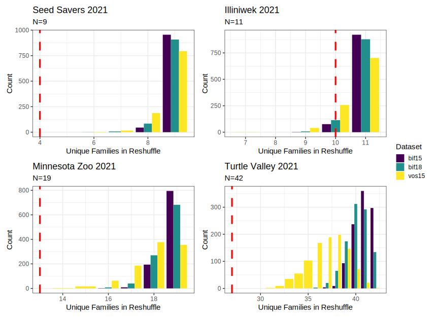

```{r setup, include=FALSE}

knitr::opts_chunk$set(echo = FALSE, message = FALSE, warning = FALSE)
```

```{r packages}


#May be redundancy in here

library(tidyverse)
library(janitor)
library(kableExtra)
# library(sf)
# library(maps)
# library(ggspatial)
# library(plotly)
# library(gghighlight)
# library(DT)
# # library(lubridate)
library(adegenet)
# library(poppr)
library(hierfstat)
# library(reshape2)
# # library(RColorBrewer)
# # library(scales)
library(readxl)
# library(pegas)
# library(lattice)
# library(PopGenReport)
# library(pophelper)
library(gridExtra)
# library(scatterpie)
# library(ggthemes)
library(lme4)
library(MuMIn)
library(multcomp)
library(flextable)

```

```{r data}

# USDA database

df_raw_USDA <- read_excel("../data/data_raw/Bombus_affinis_repository__msatdata_ver_22September2022.xlsx", sheet = 2) %>% clean_names()


# Merged genotype and metadata generated in 01d

df_rpbb_fulldata <- readRDS("../data/data_output/output_01d_merged_genotypes.Rdata")
# 
# #Error rate data of retained loci generated in 01d
# 
# df_error_rates <- readRDS("../data/data_output/output_01d_error_rates.Rdata")

# COLONY siblings data generated in 02c01 - this is "batched" at the level of 100km clusters, so it's fairly crude clustering

df_rpbb_colonizer <- read_csv("../analyses/outputs_colony/r_colonizer/rpbb_batch_colonizeR.csv")

# GENIND Object generated in 03a; this actually should contain filtered siblings now so it's a misnomer; check and correct

# gen_rpbb <- readRDS("../analyses/analyses_output/03a_rpbb_femaleNOknown_NOSibs_genind.Rdata")

gen_rpbb_flt <- readRDS("../analyses/analyses_output/03a01_gen_rpbb_flt.Rdata")

#Metadata; historic affinis states for mapping

# df_affinis_historic <- read_csv("../data/data_raw/meta_rpbb_external/rpbb_historic_counties.csv")  %>% clean_names()
# 
# # Pairwise distances between sites
# 
# df_joined_clusters <- readRDS("../data/data_output/output_01c_df_cluster100_pw_distances.Rdata")
# 
# centroids between 100km sites

df_centroids <- readRDS("../data/data_output/output_01c_df_cluster100_centroids.Rdata")
# 
# 
# # DAPC output
# 
# dapc1 <- readRDS("../analyses/analyses_output/03g_dapc_output.Rdata")
# 
# #AMOVA outputs
# 
# amova_rpbb <- readRDS("../analyses/analyses_output/03f_amova_primary_output.Rdata")
# amova_signif_rpbb <- readRDS("../analyses/analyses_output/03f_amova_signif_output.RData")
# 
# #STRUCTURE stuff
# 
# evannosummary <- readRDS("../analyses/analyses_output/03e_structure_evanno.Rdata")
# mergedk3 <- readRDS("../analyses/analyses_output/03e_structure_mergedk3.Rdata")

```


# Potential Titles

The male diploidy part is not really highlighted/emphasized in the text so probably not worth doing so in the title. 

- Analysis of Rusty Patched Bumble Bee (*Bombus affinis*) population genetics suggests evidence for spatially structured populations and warrants caution in captive breeding efforts
- Patterns of low colony abundance, isolation by distance, and male diploidy across the range of a federally endangered bumble bee (*Bombus affinis*)
- Rangewide genetic analysis of an endangered bumble bee (*Bombus affinis*) reveals population structure, male diploidy, and low colony abundances
- Spatially structured populations, isolation by distance, and low colony abundance across the range of a federally endangered bumble bee (*Bombus affinis*)


# Main Message

We document evidence for isolation by distance, low observed heterozygosity, male diploidy, and low colony abundance for the endangered Bombus affinis. We contextualize our results for imperiled bumble bee conservation. 

# Working Abstract

This is long, wordy, meandering, incomplete, and possibly inaccurate for now. Just a placeholder. 

**Parts in italics are just for my guidance in writing, not intended to be part of the abstract**

_Why are you doing this? [context and aim]_

Well-documented declines in bumble bee species across multiple continents have prompted the need for informed management plans to aid in species recovery. The Rusty Patched Bumble Bee (_Bombus affinis_) is the first federally-listed bumble bee species in North America. There is substantial interest in understanding range-wide patterns of population structure to determine appropriate conservation units and inform priority areas for potential interventions. Additionally, site-level knowledge on colony abundance is needed to understand the potential impact of development or captive rearing efforts.

_What did you do? [methods]_

To inform these conservation priorities, we conducted a coordinated collection of non-lethal _B. affinis_ genetic samples from across all extant conservation units. To determine population structure, patterns of genetic diversity, and population differentiation we conduct a variety of common population genetic measurements across the extant range. To determine typical colony abundance at sites with _B. affinis_ we also conduct site-level analyses of colony abundance as determined from genetic mark-recapture protocols at a subset of sites.

_What did you find? [core results]_

We find substantial evidence of population structuring along an east-to-west gradient in the range. Putative populations show evidence of isolation by distance and find differential Fis values across the range. We find that specimens from the Appalachians seem substantially differentiated from the rest of the extant populations and exhibit high levels of private alleles, despite our lower sample sizes from this region, and represent a distinct genetic cluster. Site-level analyses suggests low colony abundance estimates for _B. affinis_ when compared to similar datasets of common or stable species with detection rates of expected colony counts falling below X% of expected values when compared to two stable species. We detect male diploidy at a rate of ~X% across all populations. 

_What does this mean? [interpretation in context]_

Our results lend genetic support to trends from occupancy and observational studies suggesting that _B. affinis_ has undergone a recent decline and exhibits substantial spatial structure. The low colony abundances observed here suggest caution in overinterpreting the stability of populations even at sites where _B. affinis_ is regularly detected year-to-year. 

_What is it good for? [application]_

These results should help delineate more informed management units and provide context for the potential pitfalls of captive rearing programs. More targeted work on subpopulations or with clear hypotheses will be needed to tease out further nuance in our findings. 


---

# Some background notes

### Spatial Clustering of Points to Assign "Populations"

For now, all "site-level" analyses are done at a 100km spatial clustering. This is very crude, but easy to understand and work with. I think it's fair enough and a good balance to allow distinct putative populations without too many assumptions or really thinning sample sizes per cluster (they are already thin in some places!). See Figure 1 Map to see what the clusters look like. 

### COLONY/pedigree analysis

- Ran COLONY for each 100km cluster, separated by year (i.e. excluded "impossible" relationships, made COLONY run smooth that way!)
- Wrangled COLONY outputs and merged it back to the genotype data  
    - Although colonies are assigned at the 100km cluster, they can easily be examined at smaller spatial scales (e.g. filter dataset to only look at MN Zoo even though that's clustered with Twin Cities generally. Then can examine # of unique colonies at the zoo, etc)
- That is what I did for the downstream stuff. It works well.  
- For population genetic work, I removed all but one sibling at random from the data

## Potential decisions that could be reconsidered
  
Leaving these here as notes, but I feel comfortable with the decisions I've made. 

- Could reconsider the way putative populations are assigned  
- Might be slightly better practice to report multiple values of k for DAPC and STRUCTURE. Here, that would essentially be reporting results for k=4. But I don't expect any different inferences when doing this. 

  

---  

# Data Availability and Map of collections

```{r summary of data availability}

#total specimens in USDA database
n_total_specimens <- nrow(df_raw_USDA)

#total specimens with ANY genetic data
n_total_genotyped <- nrow(filter(df_raw_USDA, !is.na(name_3)))

#specimens after filtering for lat-long, sex, and other complete metadata; from 2020 or 2021; other quality control (>10 valid loci?)
n_filtered <- nrow(df_rpbb_fulldata)

# specimens used in COLONY; females, had at least 10 loci with data, was NOT from a known nest
n_colony <- nrow(df_rpbb_colonizer)

#specimens in pop-gen analyses; same as COLONY filters plus only 1 sibling per detected colony
n_popgen <- nInd(gen_rpbb_flt)

# df_sample_counts <- tibble(dataset = c("Total Specimens", "Genotyped Specimens", "Filtered Specimens", "Used in COLONY", "Used in PopGen Analysis"), samplesize = c(n_total_specimens, n_total_genotyped, n_filtered, n_colony, n_popgen))
# 
# df_sample_counts %>% 
#   kable()

n_males <- nrow(filter(df_rpbb_fulldata, sex == "male"))

```

- Total specimens in USDA database: **`r n_total_specimens`**
- Total specimens with ANY genetic data in USDA database: **`r n_total_genotyped`**
- Specimens after basic filtering: **`r n_filtered`**
  - Had known lat-long, sex, and other basic metadata
  - Was from 2020 or 2021
  - Other minor filtering
- Specimens used in COLONY: **`r n_colony`**
  - Females only
  - Had at least 10 loci with data (vast majority have 13)
  - Was NOT from a known colony (this removes quite a few specimens)
- Specimens in pop-gen analyses: **`r n_popgen`**
  - Same filters as COLONY and  
  - Only one individual per detected colony
- Number of males: **`r n_males`**


```{r map of collections, fig.height = 8, fig.width = 10}




```

**Figure 1.** Map showing the collection locations of 470 specimens available after basic initial filtering. Colors represent "population cluster" as assigned by tree method (used `hclust` and `cutree`; tree length = 100km). Greyscale grid points in the background represent a 2d density representation of observed _B. affinis_ specimens from 2016-2022. (Note: I do not know the spatial extent of those grids...)


# Note on quality control/HWE/LD/Null Alleles

HW Equilibrium, LD, and Null allele results not shown here. I need to put them together for a supplement. 
HWE: The basic idea is there is evidence that, globally, loci are out of HWE. But this is due to differences between subpopulations. So it's something to report...but not really anything to worry about downstream.

LD between loci: Not likely an issue here (p.rD and p.Ia > 0.05; no consistent linkage in the pairwise comparison either). 

Null allele frequences: within the range typical for pop gen analysis with microsatellites and unlikely to be an issue. Can cite https://www.nature.com/articles/6800545 and write it like they do in https://peerj.com/articles/13565/ where they say, "Nevertheless, the frequency of null alleles inferred with the methods of Brookfield and Chakraborty (0.09 and 0.13, respectively) is in line with values commonly reported in the literature and is unlikely to cause a major bias in downstream population structure analyses (Dakin & Avise, 2004)."

Dataset was filtered to ensure no specimens with <80% completeness (i.e. missing loci) were included, clones/duplicate checks were performed, and all loci are polymorphic (i.e. informative). 

# Population Genetic Structure

## STRUCTURE

### Evanno method for finding "best" K value

**Plot intended for supplement, not main results. 

```{r evanno, fig.height = 6, fig.width = 8}

p_evanno <- readRDS("../figures/figures_output/04d_figure_evanno.Rdata")

grid.arrange(p_evanno)

```

### STRUCTURE Plot and Summary Map


```{r structure map scaled pies, out.width="100%"}




```

**Figure 2:** Map of relative contribution of different clusters across regions. Inset plot shows typical STRUCTURE barplot with admixture results separated by geographically clustered populations. Pie charts represent the mean contribution of each cluster to the subpopulation. Pie chart sizes are scaled non-linearly by sample size and are for relative representation. 

**Note** this is somewhat messy still, but for demonstration purposes it's pretty kewl. Want to make the link between the STRUCTURE barplot and the pies more clear (they are sort of vaguely ordered similarly left-to-right as of now)


## DAPC


```{r dapc plot, fig.height=6, fig.width=8}



```

**Figure 3:** Scatterplot of Discriminant Analysis of Principle Components results with k=3. Colors are not intended to be distinguishable, but instead to show the relative gradient from Twin Cities to Appalachians. Results are largely congruent with STRUCTURE analysis. 

## AMOVA

AMOVA results, if I understand correctly, suggest that about 2.5% of the genetic structuring can be explained by between population variation. With the rest being explained by within population and within sample variation. 

```{r amova results}

readRDS("../analyses/analyses_output/03f_amova_primary_output.Rdata")

readRDS("../analyses/analyses_output/03f_amova_signif_output.RData")

```


# Genetic Diversity Measurements

## Summary Statistics

**Table 1** - Diversity metrics summary table at the 100km "site-level" clusters. 

```{r genetic diversity stats, ft.align ="center"}

df_div_stats <- readRDS("../analyses/analyses_output/03a02_output_df_sum_stats_by_site.Rdata")

# df_div_stats %>%
#   arrange(desc(N)) %>%
#   datatable(rownames = FALSE,
#             colnames = c("Cluster", "No. Specimens", "Private Alleles", "Allelic Richness"),
#             options = list(iDisplayLength = 13, dom = "t"))


df_div_stats %>% 
  flextable() %>% 
  set_header_labels(name = "100km Cluster", N = "No. Specimens", PA = "Private Alleles", AR = "Rarefied Allelic Richness") %>% 
  theme_booktabs(bold_header = TRUE)

```

&nbsp;

**Table 2** - Diversity metrics summary table at the region level as determined by STRUCTURE and DAPC clustering. 

Note that this is somewhat goofy as basically the clusters are Appalachian, Twin Cities...and everything else. So Appalachian/Twin Cities are unchanged...but in some ways it makes more sense than the arbitrary clusters. Probably might be best to make a table where both are displayed together (so there would be the overall Appalachian/Twin Cities/Central stats and then below central would be the site-specific level)


```{r genetic diversity stats region}

df_div_stats_reg <- readRDS("../analyses/analyses_output/03a02_output_df_sum_stats_by_region.Rdata")

# df_div_stats %>%
#   arrange(desc(N)) %>%
#   datatable(rownames = FALSE,
#             colnames = c("Cluster", "No. Specimens", "Private Alleles", "Allelic Richness"),
#             options = list(iDisplayLength = 13, dom = "t"))


df_div_stats_reg %>% 
  flextable() %>% 
  set_header_labels(name = "Region", N = "No. Specimens", PA = "Private Alleles", AR = "Rarefied Allelic Richness") %>% 
  theme_booktabs(bold_header = TRUE)

```

&nbsp;

## Expected Heterozygosity

```{r figure heterozygosity}



```

**Figure 4 V1:** - Mean (+/- SE) expected heterozygosity across the different 100km clusters arranged by sample size. Circle size represents sample size, values to the right are the numbers of genotyped specimens. Colors represent regional clusters. 


```{r figure heterozygosity 2}



```

**Figure 4 V2:** - Mean (+/- SE) expected (black) and observed (yellow) heterozygosity across the different 100km clusters arranged by sample size. Circle size represents sample size. 

**Note** Not sure what I prefer...it's sort of a lot to keep track of visually. Could also do this just at the region level. Columns rather than points may also help for keeping visual track of the site -> data relationship...though I usually dislike using bars for things that don't represent actual data "within" the bar. _Might make the most sense to just do He, AR, and Fis by Region as a multi-panel plot as that actually mathces the models below..._

## Models of He, AR, and Fis by lat-long or region

```{r load basic stats dataframes}

#load these here and then build df and models below...seems better than saving/loading every single output

basic_rpbb <- readRDS("../analyses/analyses_output/03a02_output_basic_rpbb.Rdata")


basic_rpbb_reg <- readRDS("../analyses/analyses_output/03a02_output_basic_rpbb_reg.Rdata")

gen_rpbb_reg <- readRDS("../analyses/analyses_output/03a02_output_gen_rpbb_reg.Rdata")

```

### Expected Heterozygosity by Lat-Long

No clear relationship, not particularly informative. 

```{r he by lat-long}

# EXTRACTING HE FOR ALL SITES, JOINING WITH CENTROITS TO HAVE LAT-LONG PER SITE
df_hs_site <- basic_rpbb$Hs %>% as_tibble(rownames = "locus") %>% pivot_longer(!locus, names_to = "site", values_to = "he") %>% 
  full_join(., df_centroids, by = c("site" = "named_cluster100"))

# MODEL BY LAT-LONG
# No clear relationship, not informative

mod_he_ll <- lmer(he ~ long_m_center + lat_m_center + (1 | locus), data = df_hs_site, REML = FALSE)
summary(mod_he_ll)
mod_null_he_ll <- lmer(he ~ 1 + (1 | locus), data = df_hs_site, REML = FALSE)
anova(mod_he_ll, mod_null_he_ll)
r.squaredGLMM(mod_he_ll)

```


### Allelic Richness by Lat-Long

No clear relationship, not particularly informative. 


```{r allelic richness by lat-long}

# EXTRACTING HE FOR ALL SITES, JOINING WITH CENTROITS TO HAVE LAT-LONG PER SITE
df_ar_site <- allelic.richness(genind2hierfstat(gen_rpbb_flt))$Ar %>% as_tibble(rownames = "locus") %>% pivot_longer(!locus, names_to = "site", values_to = "richness") %>% 
    full_join(., df_centroids, by = c("site" = "named_cluster100"))

# MODEL BY LAT-LONG
# No clear relationship, not informative

mod_ar_ll <- lmer(richness ~ long_m_center + lat_m_center + (1 | locus), data = df_ar_site, REML = FALSE)
summary(mod_ar_ll)
mod_null_ar_ll <- lmer(richness ~ 1 + (1 | locus), data = df_ar_site, REML = FALSE)
anova(mod_ar_ll, mod_null_ar_ll)
r.squaredGLMM(mod_ar_ll)

```


### Fis by Lat-Long

No clear relationship, not particularly informative. 


```{r fis by lat-long}

# EXTRACTING FIS FOR ALL SITES, JOINING WITH CENTROITS TO HAVE LAT-LONG PER SITE

df_fis_site <- basic_rpbb$Fis %>% as_tibble(rownames = "locus") %>% pivot_longer(!locus, names_to = "site", values_to = "fis") %>% 
    full_join(., df_centroids, by = c("site" = "named_cluster100"))


# MODEL LAT-LONG
# Not informative

mod_fis_ll <- lmer(fis ~ lat_m_center + long_m_center + (1 | locus), data = df_fis_site, REML = FALSE)
summary(mod_fis_ll)
mod_null_fis_ll <- lmer(fis ~ 1 + (1 | locus), data = df_fis_site, REML = FALSE)
anova(mod_fis_ll, mod_null_fis_ll)
r.squaredGLMM(mod_fis_ll)

```


### Expected Heterozygosity by Region

No clear relationship, not particularly informative. 


```{r expected he by region}

# ASSIGNING HE (HS) TO REGIOn BY LOCUS
df_hs_reg <- basic_rpbb_reg$Hs %>% as_tibble(rownames = "locus") %>% pivot_longer(!locus, names_to = "region", values_to = "he")

# FIT MODEL OF HE ~ REGION WITH LOCUS AS RANDOM
# No significant difference/relationship
mod_he_reg <- lmer(he ~ region + (1 | locus), data = df_hs_reg, REML = FALSE)
summary(mod_he_reg)
mod_null_he_reg <- lmer(he ~ 1 + (1 | locus), data = df_hs_reg, REML = FALSE)
anova(mod_he_reg, mod_null_he_reg)
r.squaredGLMM(mod_he_reg)
posthoc_he_reg <- glht(mod_he_reg, linfct = mcp(region = "Tukey"))
summary(posthoc_he_reg)

```


### Allelic Richness by Region

Not a strong relationship, but suggestions Appalachian has a lower AR. This is somewhat silly though, as the region of collection is substantially smaller. 

```{r allelic by region}

# EXTRACT VALUES BY REGION
df_ar_reg <- allelic.richness(genind2hierfstat(gen_rpbb_reg))$Ar %>% as_tibble(rownames = "locus") %>% pivot_longer(!locus, names_to = "region", values_to = "ar")

# FIT MODEL, RUN COMPARISONS
# Significant with Appalachian having lower allelic richness than others -- Appalachian collections though also represent a much smaller physical space!
mod_ar_reg <- lmer(ar ~ region + (1 | locus), data = df_ar_reg, REML = FALSE)
summary(mod_ar_reg)
mod_null_ar_reg <- lmer(ar ~ 1 + (1 | locus), data = df_ar_reg, REML = FALSE)
anova(mod_ar_reg, mod_null_ar_reg)
r.squaredGLMM(mod_ar_reg)
posthoc_ar_reg <- glht(mod_ar_reg, linfct = mcp(region = "Tukey"))
summary(posthoc_ar_reg)

```


### Fis by Region

The strongest relationship. Suggests that Appalachian has lowest Fis values (this is visually reflected in comparing observed v. expected heterozygosity in the figure above; bigger the gap bigger the Fis value basically). Again, a bit of a silly comparison because if we compared to any one site within the Central region, we may get a different result...but it still seems more informative than doing dozens of pairwise comparisons. 

```{r fis by region}

# EXTRACT VALUES

df_fis_reg <- basic_rpbb_reg$Fis %>% as_tibble(rownames = "locus") %>% pivot_longer(!locus, names_to = "region", values_to = "fis")

# FIT A MODEL, COMPARE
# Appalachian substantially lower than Central or Northwest (twin cities, really); sort of a contrasting result in my mind with AR as lower Fis value would be considered "good"...observed # of heterozygotes approaching our expected value...

mod_fis_reg <- lmer(fis ~ region + (1 | locus), data = df_fis_reg, REML = FALSE)
summary(mod_fis_reg)
mod_null_fis_reg <- lmer(fis ~ 1 + (1 | locus), data = df_fis_reg, REML = FALSE)
anova(mod_fis_reg, mod_null_fis_reg)
r.squaredGLMM(mod_fis_reg)
posthoc_fis_reg <- glht(mod_fis_reg, linfct = mcp(region = "Tukey"))
summary(posthoc_fis_reg)

```

# Population Differentiation

## Isolation by Distance

```{r fst by distance}



```

**Figure 5 V1:** Fst as a function of linear distance between sites. 

Output of mantel test using Pearson correlation and no correction for distance

```{r fst mantel}

readRDS("../analyses/analyses_output/03a03_output_mod_mantel_pearson.Rdata")

```


```{r fst by log distance}



```

**Figure 5 V1:** Fst as a function of log of linear distance between sites. 

Output of mantel test using Pearson correlation and log distance

```{r fst mantel log}

readRDS("../analyses/analyses_output/03a03_output_mod_mantel_log.Rdata")

```

Output of mantel test using Spearman rank correlation (this probably is the most appropriate model as it makes no assumptions about linear relationship of the geographic distances)

```{r fst mantel spearman}

readRDS("../analyses/analyses_output/03a03_output_mod_mantel_spearman.Rdata")

```

In any event, there is evidence for isolation by distance. 

## Pairwise Fst matrix

Not sure if this is useful or wanted...but here's a heatmap showing the pairwise Fst values. It contains basically the same data as the geographic test above, but might allow for specific comparisons among sites of interest. Egregious RPBB color scheme. :)

```{r fst matrix}



```

# Site-Level Analysis of Colony Abundance

Colony was run at the 100km cluster level, but then subsets of that data were analyzed at individual sites, defined as 10km radius and for separate years for sites with multiple years of data. This allowed for successful COLONY assignment without excessive numbers of datasets. 

This was done for all sites, but here I only display sites with at least 9 specimens. 

## Number of Colonies at Sites and Comparison to Two Common Species


<!-- ```{r colony results allsites} -->

<!-- readRDS("../analyses/analyses_output/03c_bigsites_capwireoutput.Rdata") %>% -->
<!--   mutate_if(is.numeric, ~round(., 2)) %>% -->
<!--   arrange(prop_detected) %>% -->
<!--   flextable() %>% -->
<!--   set_header_labels(custom_name = "10km Site", n_genotyped = "N Genotyped", n_colonies = "N Colonies from COLONY", ml.colony.num = "ML Colony Number from Capwire", CI.lower = "95% CI of ML, low", CI.upper = "95% CI of ML, high", prop_detected = "Proportion of Detected Colonies (N Colonies/ML # of Colonies)") %>% -->
<!--   colformat_num(na_str = "NA") -->

<!-- ``` -->

**Table 3** - Numbers of samples, colony abundance estimates, and expected number of colonies from sites (10km cluster) with at least 9 specimens in a given year. 95% CI limits of 1000 represent the maximum range possible and suggest a reliable estimate cannot be obtained due to high colony abundance.

The colonies of "Probability from..." represent if we resampled a dataset of, for example, B. vosnesenskii from the Sierras 1000 times, how many of those times we would observe similar numbers of colonies given a sample size. 

For example, at Illiniwek21 we genotyped 11 specimens and detect 10 colonies from Capwire. If we resample 11 specimens from the vosnesenskii dataset 1000 times, about 28% of the time we observe 10 or fewer colonies (72% of the time we observe more than 10 colonies). 

At the Minnesota Zoo in 2021 (MNZoo21) we detected 15 colonies from 19 species. When we resample 19 individuals randomly 1000 times from the bifarius datasets, we NEVER observe 15 colonies. There are always more colonies. Only 1% of the time did we observe this level of colony abundance from the vosnesnkii dataset, the other 99% of the time, you'd expect to observe 16 or more colonies (usually 18 or 19).

Below there is a figure that shows the same pattern but visually. 


```{r comparison to sierras}

readRDS("../analyses/analyses_output/03d_joined_comparison_to_sierras.Rdata") %>%
  mutate_if(is.numeric, ~round(., 2)) %>%
  arrange(prop_detected) %>%
  flextable() %>%
  set_header_labels(custom_name = "10km Site", n_genotyped = "N Genotyped", n_colonies = "N Colonies from COLONY", ml.colony.num = "ML Colony Number from Capwire", CI.lower = "95% CI of ML, low", CI.upper = "95% CI of ML, high", prop_detected = "Proportion of Detected Colonies (N Colonies/ML # of Colonies)", prob_bif15 = "Probabilty from B. bifarius Set1", prob_bif18 = "Probability from B. bifarius Set2", prob_vos15 = "Probability from B. vosnesenskii Set1") %>%
  colformat_num(na_str = "NA")

```

&nbsp;


```{r figure of reshuffles}



```

**Figure 6** - Four representative examples of the reshuffling procedure at N=9, N=11, N=19, and N=42. Red lines represent the detected number of B. affinis colonies from the number genotyped (e.g. panel A; 4 colonies are detected from 9 specimens). Colored bars represent the results from resampling a dataset of B. bifarius (2015 and 2018) or B. vosnesenskii 1000 times for the chosen N level. 

# Male Diploidy

**Note** Not sure where this fits into the story. Could be down here with site-level results, or could be with Fis (as supporting evidence of inbreeding and not some other assortive mating event). Also not sure the best calculations to use or report. 

**Table 4a.** Numbers of diploid males at thresholds of 1 heterozygous loci

```{r diploid 1 locus}

#n_male is the number of males from the site, n_female number of females, n_total is total, n_dip_total is the number of diploid/heterozygous individuals from the site, n_dip_male and n_dip_female are the numbers of heterozygous individuals by sex, cor_prop_dip_male is the "corrected" proportion of diploid males as in the proportion of males that are diploid compared to the total number of diploid individuals in the dataset, and total_prop_dip_male is just the number of diploid males/number of males

df_het_1locus <- readRDS("../analyses/analyses_output/03b_output_het1locus.Rdata")

df_het_1locus %>% 
  flextable() %>% 
  set_header_labels(values = c("100km Site", "N Males", "N Females" ,"N Total" ,"Total N Heterozygotes", "N Heterozygous Males", "N Heterozygous Females", "N Het Male / Total Het", "N Het Male / Total Males"))

```

**Table 4b.** Numbers of diploid males at thresholds of 2 heterozygous loci

```{r diploid 2 locus}

#n_male is the number of males from the site, n_female number of females, n_total is total, n_dip_total is the number of diploid/heterozygous individuals from the site, n_dip_male and n_dip_female are the numbers of heterozygous individuals by sex, cor_prop_dip_male is the "corrected" proportion of diploid males as in the proportion of males that are diploid compared to the total number of diploid individuals in the dataset, and total_prop_dip_male is just the number of diploid males/number of males

df_het_2locus <- readRDS("../analyses/analyses_output/03b_output_het2locus.Rdata")

df_het_2locus %>% 
  flextable() %>% 
  set_header_labels(values = c("100km Site", "N Males", "N Females" ,"N Total" ,"Total N Heterozygotes", "N Heterozygous Males", "N Heterozygous Females", "N Het Male / Total Het", "N Het Male / Total Males"))

```

# Stuff not done, that could be done

- Analysis of specimens from known nests. Could run COLONY and do some sort of relatedness tests. Likely to be interesting, just not sure if it "needs" to be in this manuscript
- Separation distance, foraging distance, etc various spatial things from the detected colonies. Again, not sure if tht should go here or in a separate thing. Might just be worth noting as it's a research need just not very interesting.
- Could relate colony abundance to landscape scale factors (e.g. agricultural cover); just not sure we have very reliable data for doing that...and certainly seems like we'd want that to be separate from this broader treatment of genetics
- Similar to above point, could meausre landscape resistence between sites...but again not sure that matters so much as just knowing yeah geographic distance "isolateS" the populations. Might not have enough power to do it "right" so might be better to not do it at all
- Various bespoke site analysis favors for people...not really sure what, but keep in mind certain folks might want to know certain things about "their" specimens